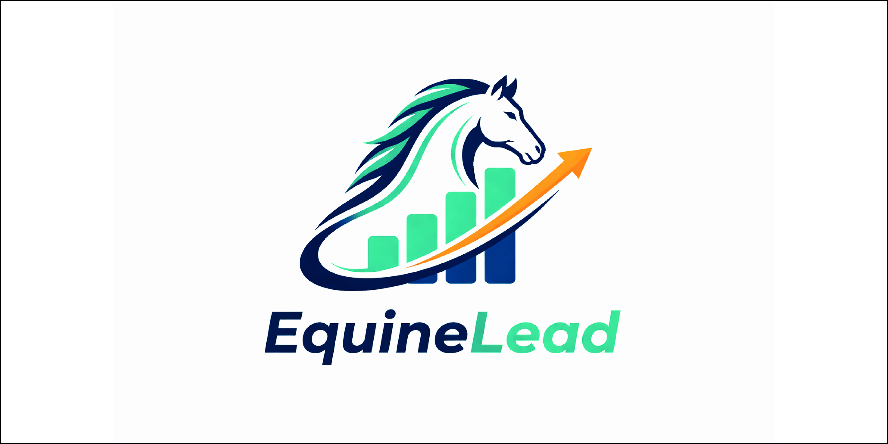
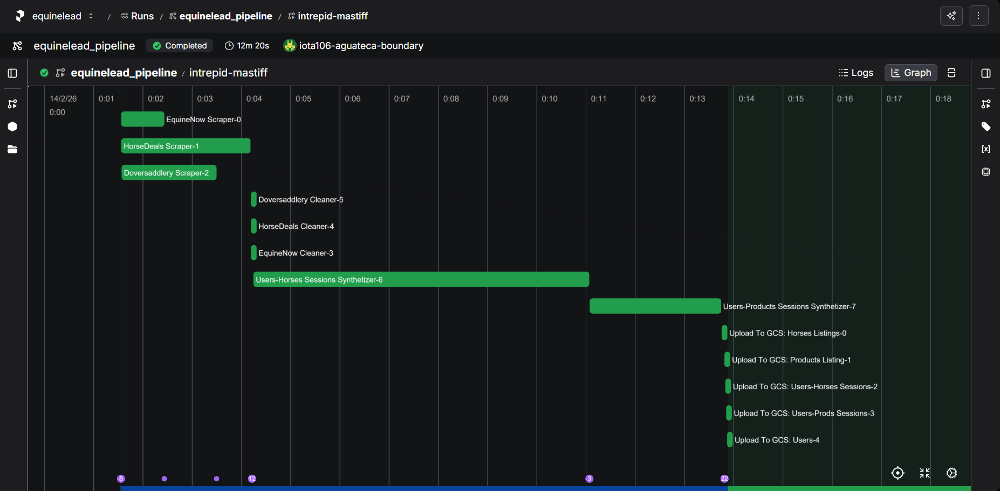

# EquineLead: Data-Driven Growth Engine for the Horse Industry


**EquineLead** es un motor de crecimiento basado en datos diseñado para resolver la fragmentación del mercado ecuestre. Este sistema transforma la navegación casual en leads calificados mediante la integración de scrapers inteligentes, embudos automatizados y modelos de propensión de compra.

---

## 📖 Tabla de Contenidos
- [Definición del Problema](#definición-del-problema)
- [Arquitectura y Stack](#arquitectura-del-sistema)
- [Infraestructura (Terraform)](#-infraestructura-como-código-iac)
- [Pipeline de Datos](#pipeline-de-datos-etlelt)
- [Guía de Ejecución Rápida](#guía-de-ejecución-quick-start)

---

## Definición del Problema (Business Understanding)
### El Desafío
La industria ecuestre opera en un ecosistema nicho, altamente fragmentado y con costos de adquisición (CAC) elevados. Actualmente, identificar a un comprador de un caballo de salto de $50,000 frente a un entusiasta casual es una tarea manual e ineficiente.

### Objetivos del Proyecto
+ **Identificación de Leads de Alto Valor**: Clasificar automáticamente usuarios en los cuatro verticales: Eventos, Servicios, Caballos y Equipamiento.
+ **Reducción del Ciclo de Venta**: Acortar el tiempo entre el "interés inicial" y la "calificación (SQL)" mediante scoring predictivo.
+ **Optimización de B2B y B2C**: Diferenciar el comportamiento de propietarios individuales frente a administradores de centros hípicos o mayoristas.

### KPIs de Éxito
+ **Lead Quality Score (LQS)**: Precisión del modelo para predecir la conversión (Meta: >80%).
+ **CAC Reduction**: Reducción esperada del 15% en costos de marketing mediante segmentación precisa.
+ **Conversion Rate (CVR)**: Mejora del flujo de ventas en el vertical de "Caballos de Alto Valor".

---

## Arquitectura del Sistema
El proyecto está diseñado bajo principios de Modern Data Stack, priorizando la velocidad de ejecución y la observabilidad.

### 🛠 Stack Tecnológico

+ **Orquestación**: Prefect (Local + Prefect Cloud).
+ **Gestión de Entorno**: UV (Instalación de dependencias 70% más rápida que pip).
+ **Contenerización**: Docker & Docker-compose.
+ **Ingesta**: Playwright (Dinámico), BeautifulSoup4 (Estático)
+ **Cloud Storage**: (Data Lake en formato Parquet)
+ **Data Synthesis**: Python Faker + Proyecciones de [Rees46 Dataset](https://www.kaggle.com/mkechinov/ecommerce-behavior-data-from-multi-category-store).

---

## 🏗️ Infraestructura como Código (IaC)

Para garantizar la reproducibilidad total, la infraestructura de la nube (Google Cloud Storage) se gestiona mediante **Terraform**. Esto permite levantar el Data Lake y configurar los permisos necesarios en segundos.

### Configuración de Infraestructura

1.  **Requisitos**: Tener instalado [Terraform](https://www.terraform.io/downloads) y el [Google Cloud CLI](https://cloud.google.com/sdk/docs/install).
2.  **Autenticación**:
    ```powershell
    gcloud auth application-default login
    ```
3.  **Personalización**:
    Crea un archivo `infra/terraform/terraform.tfvars` para definir tus variables:
    ```hcl
    project_id           = "tu-id-de-proyecto"
    region               = "us_weast1"
    bucket_name          = "equinelead-datalake"
    storage_class        = "STANDARD"
    service_account_name = "your-admin"
    ```
4.  **Despliegue**:
    ```powershell
    # Inicializar y aplicar cambios
    terraform -chdir=infra/terraform init
    terraform -chdir=infra/terraform validate
    terraform -chdir=infra/terraform plan -out=tfplan
    terraform -chdir=infra/terraform apply "tfplan"
    ```

### Gestión de Credenciales
Una vez completado el `apply`, Terraform generará una Service Account Key. Extráela para que el pipeline de Docker pueda autenticarse:
```powershell
$rawKey = terraform -chdir=infra/terraform output -raw service_account_key
[System.Text.Encoding]::UTF8.GetString([System.Convert]::FromBase64String($rawKey)) | Out-File -FilePath "./secrets/gcp-sa-key.json" -Encoding ascii

---

## Pipeline de Datos (ETL/ELT)



### Ingesta y Scraping Paralelizado
El pipeline ejecuta múltiples scrapers de forma concurrente dentro de contenedores Docker:
+ **Playwright**: Para la extracción de datos en sitios dinámicos de subastas y clasificados.
+ **BeautifulSoup4 + lxml**: Para el procesamiento rápido de directorios estáticos de servicios y eventos.

### Generación de Datos Sintéticos (Behavioral Tracking)
Para simular el comportamiento de usuario, se mapearon los eventos del dataset de Rees46 a un entorno ecuestre ficticio:

+ **Mapeo de Categorías**: Los productos electrónicos/hogar se transformaron en categorías como Sillas de Salto, Suplementos y Publicaciones de Caballos.
+ **Identidades con Faker**: Se generaron perfiles de usuarios únicos (Leads) con historiales de navegación coherentes.
+ **Proyección de Eventos**: Se recrearon funnels de conversión (view -> cart -> purchase) para identificar patrones de "Intención de Compra".

### Limpieza y Carga (GCP)
+ **Transformación**: Limpieza de strings, normalización de datos numericos y manejo de valores nulos en paralelo.
+ **Storage**: Los datos finales se serializan en Parquet para optimizar el peso y la velocidad de consulta, y se suben a un bucket de Google Cloud Storage.

### Diagrama Entidad-Relación (DER)


---

## Guía de Ejecución (Quick Start)
Este proyecto es totalmente reproducible y "Plug & Play".

> Requisitos: Docker y una cuenta en Prefect Cloud (opcional para logs).

#### Clonar el repositorio:

```bash
git clone https://github.com/No-Country-simulation/S02-26-E45-Data_Science_EquineLead
cd S02-26-E45-Data_Science_EquineLead
```
#### Configurar variables de entorno:
Crea un archivo .env con tus credenciales de GCP y el API Key de Prefect.

```bash
PREFECT_API_URL="https://api.prefect.cloud/api/accounts/[ACCOUNT-ID]/workspaces/[WORKSPACE-ID]"
PREFECT_API_KEY="[API-KEY]"
GCP_PROJECT_ID="tu_id_proyecto"
GCP_BUCKET_NAME="tu_nombre_bucket"
GOOGLE_APPLICATION_CREDENTIALS="path_to_credentials_json"
```

#### Loguearte en Prefect Cloud:

```bash
prefect cloud login
```

#### Levantar la infraestructura:

```bash
docker compose --profile pipeline up --build
```

Este comando levantará el agente de Prefect, construira el contenedor e instalará dependencias con UV y disparará el flujo de ingesta.

> *Nota Técnica*: Gracias al gestor UV, la construcción de la imagen ignora el overhead de pip, logrando entornos listos en segundos