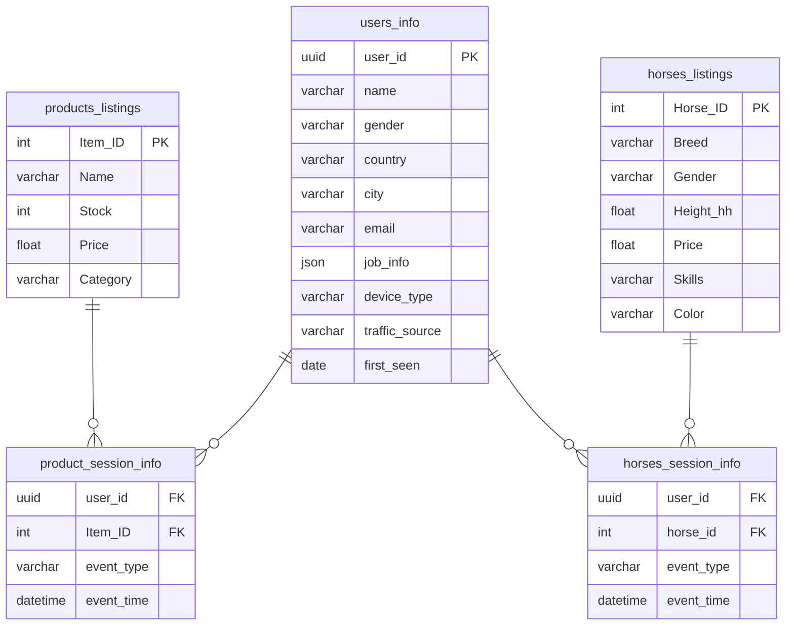

# EquineLead: Data-Driven Growth Engine for the Horse Industry


**EquineLead** es un motor de crecimiento basado en datos diseñado para resolver la fragmentación del mercado ecuestre. Este sistema transforma la navegación casual en leads calificados mediante la integración de scrapers inteligentes, embudos automatizados y modelos de propensión de compra.

---

## 🔗 Accesos Rápidos

| Entorno | URL | Descripción |
|---|---|---|
| 📊 **Dashboard Analytics** | [equinelead.streamlit.app](https://equinelead.streamlit.app/) | Executive Dashboard interactivo con KPIs, funnels y ML |
| ⚡ **API de Inferencia** | [equinelead-api](https://equinelead-api-516367992092.us-east1.run.app/) | REST API desplegada en Cloud Run para scoring en tiempo real |
| 🤗 **Demo de Modelos** | [HuggingFace Space](https://huggingface.co/spaces/Itrs/EquineLead-Models) | Demo interactivo del motor de recomendación y Lead Scoring |

---

## 📖 Tabla de Contenidos

- [Definición del Problema](#-definición-del-problema)
- [Arquitectura y Stack](#%EF%B8%8F-arquitectura-del-sistema)
- [Pipeline de Datos (ETL/ELT)](#-pipeline-de-datos-etlelt)
- [Modelos de Machine Learning](#-modelos-de-machine-learning)
  - [Lead Scoring en Cascada](#lead-scoring-en-cascada)
  - [Motor de Recomendación KNN](#motor-de-recomendación-knn)
- [Executive Dashboard](#-executive-dashboard)
- [API de Inferencia](#-api-de-inferencia)
- [Infraestructura como Código (IaC)](#-infraestructura-como-código-iac)
- [Guía de Ejecución Rápida](#-guía-de-ejecución-quick-start)
- [Estructura del Proyecto](#-estructura-del-proyecto)
- [Equipo y Contribuciones](#-equipo-y-contribuciones)

---

## 🎯 Definición del Problema

### El Desafío

La industria ecuestre opera en un ecosistema nicho, altamente fragmentado y con costos de adquisición (CAC) elevados. Actualmente, identificar a un comprador de un caballo de salto de $50,000 frente a un entusiasta casual es una tarea manual e ineficiente.

### Objetivos del Proyecto

- **Identificación de Leads de Alto Valor:** Clasificar automáticamente usuarios en los cuatro verticales: Eventos, Servicios, Caballos y Equipamiento.
- **Reducción del Ciclo de Venta:** Acortar el tiempo entre el "interés inicial" y la "calificación (SQL)" mediante scoring predictivo.
- **Optimización de B2B y B2C:** Diferenciar el comportamiento de propietarios individuales frente a administradores de centros hípicos o mayoristas.

### KPIs de Éxito

| KPI | Descripción | Meta |
|---|---|---|
| **Lead Quality Score (LQS)** | Precisión del modelo para predecir conversión | > 80% |
| **CAC Reduction** | Reducción de costos de marketing mediante segmentación precisa | 15% |
| **F2 Lead Oro** | F2-score sobre la clase de mayor valor | ≥ 0.51 |
| **Conversion Rate (CVR)** | Mejora del flujo de ventas en caballos de alto valor | Incremento medible |

---

## 🛠️ Arquitectura del Sistema

El proyecto está diseñado bajo principios de **Modern Data Stack**, priorizando la velocidad de ejecución y la observabilidad.

### Stack Tecnológico

| Capa | Tecnología | Rol |
|---|---|---|
| **Orquestación** | Prefect 2 | Pipelines ETL y scheduling |
| **Entorno** | UV | Gestión de dependencias (70% más rápido que pip) |
| **Contenerización** | Docker & Docker Compose | Aislamiento de servicios |
| **Ingesta** | Playwright + BeautifulSoup4 + lxml | Scraping dinámico y estático |
| **Storage** | Google Cloud Storage | Data Lake en formato Parquet |
| **Versionado de Datos** | DVC + DagsHub | Trazabilidad de datasets |
| **ML Training** | XGBoost, LightGBM, CatBoost, scikit-learn | Modelado predictivo |
| **MLOps** | MLflow + DagsHub | Tracking de experimentos y artefactos |
| **Serving** | FastAPI + Cloud Run | API REST de inferencia en producción |
| **Visualización** | Streamlit + Plotly | Dashboard ejecutivo |
| **IaC** | Terraform | Infraestructura reproducible en GCP |
| **Data Synthesis** | Faker + proyecciones Rees46 | Generación de comportamiento simulado |

---

## 🔄 Pipeline de Datos (ETL/ELT)


### Ingesta y Scraping Paralelizado

El pipeline ejecuta múltiples scrapers de forma concurrente dentro de contenedores Docker:

- **Playwright:** Para la extracción de datos en sitios dinámicos (EquineNow — listings de caballos).
- **BeautifulSoup4 + lxml:** Para el procesamiento rápido de directorios estáticos (DoverSaddlery — productos ecuestres).

### Generación de Datos Sintéticos (Behavioral Tracking)

Para simular el comportamiento de usuario, se mapearon los eventos del dataset de [Rees46](https://www.kaggle.com/mkechinov/ecommerce-behavior-data-from-multi-category-store) a un entorno ecuestre:

- **Mapeo de Categorías:** Productos electrónicos/hogar → Sillas de Salto, Suplementos, Publicaciones.
- **Identidades con Faker:** Perfiles de usuarios únicos con historiales de navegación coherentes.
- **Proyección de Eventos:** Funnels de conversión `view → cart → purchase`.

### Diagrama Entidad-Relación (DER)


```mermaid
erDiagram
    products_listings ||--o{ product_session_info : ""
    users_info ||--o{ product_session_info : ""
    users_info ||--o{ horses_session_info : ""
    horses_listings ||--o{ horses_session_info : ""

    users_info {
        uuid user_id PK
        varchar name
        varchar gender
        varchar country
        varchar city
        varchar email
        json job_info
        varchar device_type
        varchar traffic_source
        date first_seen
    }

    horses_session_info {
        uuid user_id FK
        int horse_id FK
        varchar event_type
        datetime event_time
    }

    product_session_info {
        uuid user_id FK
        int Item_ID FK
        varchar event_type
        datetime event_time
    }

    horses_listings {
        int Horse_ID PK
        varchar Breed
        varchar Gender
        float Height_hh
        float Price
        varchar Skills
        varchar Color
    }

    products_listings {
        int Item_ID PK
        varchar Name
        int Stock
        float Price
        varchar Category
    }
```

### Descarga de Datos con DVC

Los datasets NO se almacenan en Git — se descargan bajo demanda:

```bash
# Autenticarse con Google Cloud
gcloud auth application-default login

# Descargar datos versionados
dvc pull
```

---

## 🧠 Modelos de Machine Learning

### Lead Scoring en Cascada

#### Definición de Targets

Los usuarios se clasifican en tres segmentos de forma **independiente** para dos verticales:

| Segmento | Criterio Caballos | Criterio Productos |
|---|---|---|
| 🥉 **Lead Bronce** | Sin compras | Sin compras |
| 🥈 **Lead Plata** | Compra < USD 50.000 | Compra < USD 2.000 |
| 🏆 **Lead Oro** | Compra ≥ USD 50.000 | Compra ≥ USD 2.000 |

#### Arquitectura en Cascada (2 clasificadores binarios)

```
Usuario
   │
   ▼
[Paso 1] ¿Tiene intención de compra?
    0 = Lead Bronce  →  FIN
    1 = Plata/Oro    →  continúa
              │
              ▼
         [Paso 2] ¿Es comprador de alto valor?
              0 = Lead Plata  →  FIN
              1 = Lead Oro    →  FIN
```

Esto genera **4 modelos**: `P1-horse`, `P1-prods`, `P2-horse`, `P2-prods`.

#### Feature Engineering Destacado

| Feature | Descripción | Señal |
|---|---|---|
| `max_horse_price_viewed` | Precio máximo explorado por el usuario | ⭐⭐⭐ |
| `max_visitas_mismo_caballo` | Revisitas a un mismo caballo | ⭐⭐⭐ |
| `horses_added_to_cart` | Acción de alta intención | ⭐⭐⭐ |
| `ratio_recurrencia_horse` | Concentración de revisitas | ⭐⭐ |
| `prestige_score` | Score laboral del usuario (1–10) | ⭐⭐ |
| `user_antiguedad_dias` | Madurez en la plataforma | ⭐⭐ |
| `viewed_sport_elite` | Interés en caballos FEI/dressage | ⭐⭐ |

#### Resultados del Modelo Campeón (XGB Tuneado)

| Target | F2 Macro | F2 Lead Oro | Gap Overfitting P2 |
|---|---|---|---|
| `horse_target` | ~0.48 | **~0.51** | ~0.10 |
| `prods_target` | ~0.47 | **~0.49** | ~0.11 |

Los experimentos completos están disponibles en DagsHub MLflow:
`https://dagshub.com/aletbm/S02-26-E45-Data_Science_EquineLead.mlflow`

#### Artefactos del Pipeline de Producción

| Artefacto | Descripción |
|---|---|
| `modelo_p1_horse.pkl` | Clasificador binario Bronce vs Plata/Oro (caballos) |
| `modelo_p2_horse.pkl` | Clasificador binario Plata vs Oro (caballos) |
| `modelo_p1_prods.pkl` | Clasificador binario Bronce vs Plata/Oro (productos) |
| `modelo_p2_prods.pkl` | Clasificador binario Plata vs Oro (productos) |
| `target_encoder.pkl` | TargetEncoder con smoothing=10 sobre X_train |
| `limites_capping.pkl` | Límites P99 por columna calculados sobre X_train |
| `cols_horse.pkl` | Lista de 27 features del dominio caballos |
| `cols_prods.pkl` | Lista de 22 features del dominio productos |

---

### Motor de Recomendación KNN

Un segundo sistema de IA basado en **K-Nearest Neighbors con Similitud de Coseno** para recomendar caballos similares:

- **NLP:** `TF-IDF Vectorizer` sobre razas y pelajes para procesar semántica.
- **Optimización de Memoria:** Matrices CSR (Compressed Sparse Row) para datos dispersos.
- **Precisión Promedio:** **74.65%** de similitud de coseno.

#### Features de Entrada para la API

| Variable | Tipo | Descripción |
|---|---|---|
| `price` | Float | Precio del caballo |
| `height_hh` | Float | Altura en hands high |
| `age` | Int | Edad en años |
| `breed` | Vectorized | Raza (procesada semánticamente) |
| `color` | Vectorized | Pelaje (procesado semánticamente) |

---

## 📊 Executive Dashboard

**[→ Acceder al Dashboard](https://equinelead.streamlit.app/)**


Dashboard modular construido con Streamlit y Plotly, con tema oscuro estilo Power BI. Organizado en 6 vistas:

| Vista | Contenido |
|---|---|
| 📊 **Executive Summary** | KPIs globales, crecimiento de usuarios, mapa de penetración |
| 🐎 **Horse Market Analytics** | Distribución de precios, razas, géneros, geografía |
| 📦 **Equestrian Retail Metrics** | Inventario, categorías, distribución de precios de productos |
| 🌍 **Global Audience** | Demografía, dispositivos, fuentes de tráfico, cohorts |
| ⚡ **Funnel & Session Telemetry** | Funnels de conversión, volumen de eventos, top items |
| 🧠 **AI Subsystem (DagsHub)** | Conexión en vivo a experimentos MLflow, métricas y plots |

### Ejecución Local

```bash
# Desde la raíz del repositorio
streamlit run app/app.py
```

---

## ⚡ API de Inferencia

**[→ Acceder a la API](https://equinelead-api-516367992092.us-east1.run.app/)**


REST API construida con FastAPI y desplegada en **Google Cloud Run**. Expone el pipeline de Lead Scoring en cascada.

### Ejemplo de Request

```bash
POST /predict
Content-Type: application/json

{
  "user_id": "abc-123",
  "horses_viewed": 42,
  "max_horse_price_viewed": 75000,
  "user_prestige_score": 8,
  ...
}
```

### Ejemplo de Response

```json
{
  "horse_lead": "Lead Oro",
  "prods_lead": "Lead Plata",
  "horse_p1_proba": 0.91,
  "prods_p1_proba": 0.74
}
```

### Despliegue con Docker

```bash
# Build y run local
make test-api

# Deploy a Cloud Run
make deploy-api
```

---

## 🤗 Demo Interactivo (HuggingFace)

**[→ Acceder al Demo](https://huggingface.co/spaces/Itrs/EquineLead-Models)**


Interfaz Gradio alojada en HuggingFace Spaces que permite explorar el motor de recomendación KNN y el pipeline de Lead Scoring sin necesidad de configuración local. Ideal para demostraciones rápidas del modelo campeón.

---

## 🏗️ Infraestructura como Código (IaC)

Para garantizar la reproducibilidad total, la infraestructura de la nube se gestiona mediante **Terraform**.

### Configuración

```bash
# 1. Autenticarse
gcloud auth application-default login

# 2. Crear infra/terraform/terraform.tfvars
project_id           = "tu-id-de-proyecto"
region               = "us-east1"
bucket_name          = "equinelead-datalake"
storage_class        = "STANDARD"
service_account_name = "your-admin"
image                = "docker.io/usuario/equinelead-api:latest"

# 3. Desplegar
make terraform-deploy

# 4. Extraer Service Account Key
$rawKey = terraform -chdir=infra/terraform output -raw service_account_key
[System.Text.Encoding]::UTF8.GetString([System.Convert]::FromBase64String($rawKey)) | Out-File -FilePath "./secrets/gcp-sa-key.json" -Encoding ascii
```

---

## 🚀 Guía de Ejecución (Quick Start)

> **Requisitos:** Docker, gcloud CLI, y cuenta en Prefect Cloud (opcional).

### 1. Clonar el repositorio

```bash
git clone https://github.com/No-Country-simulation/S02-26-E45-Data_Science_EquineLead
cd S02-26-E45-Data_Science_EquineLead
```

### 2. Configurar variables de entorno

```bash
# Crear .env con credenciales
PREFECT_API_URL="https://api.prefect.cloud/api/accounts/[ID]/workspaces/[ID]"
PREFECT_API_KEY="[API-KEY]"
GCP_PROJECT_ID="tu_id_proyecto"
GCP_BUCKET_NAME="tu_nombre_bucket"
GOOGLE_APPLICATION_CREDENTIALS="path_to_credentials.json"
```

### 3. Instalar dependencias (UV)

```bash
pip install uv
uv sync --all-groups
```

### 4. Descargar los datos

```bash
gcloud auth application-default login
dvc pull
```

### 5. Opciones de ejecución

```bash
# Ejecutar pipeline de datos completo (Docker)
make run-data-pipeline

# Levantar solo servidor Prefect
make run-prefect

# Levantar dashboard
make run-app

# Test local de la API
make test-api
```

---

## 📁 Estructura del Proyecto

```
S02-26-E45-Data_Science_EquineLead/
│
├── app/                        # Executive Dashboard (Streamlit)
│   ├── app.py                  # Router principal
│   ├── modules/                # Páginas del dashboard
│   ├── components/             # Componentes UI reutilizables
│   └── utils/                  # Data loaders y estilos
│
├── src/
│   ├── api/                    # FastAPI — servicio de inferencia
│   ├── experiments/
│   │   ├── engine/             # Motor de recomendación KNN
│   │   └── leads/              # Lead Scoring (features, train, model)
│   ├── flows/                  # Flujos Prefect (ETL)
│   └── scrapers/               # Scrapers (Playwright + BS4)
│
├── data/
│   ├── raw/                    # Datos originales (DVC)
│   ├── clean/                  # Datos procesados (DVC)
│   └── tracking/               # Archivos auxiliares (Git)
│
├── docs/                       # Documentación técnica
├── infra/terraform/            # IaC — GCP Storage + Cloud Run
├── deployment/                 # Dockerfiles, docker-compose, cloudbuild
├── models/                     # Artefactos serializados del campeón
├── assets/                     # Imágenes y recursos visuales
├── pyproject.toml              # Dependencias por grupo (UV)
├── Makefile                    # Comandos de ejecución
└── .pre-commit-config.yaml     # Linters y hooks (ruff, gitleaks)
```

---

## 📚 Documentación Adicional

| Documento | Descripción |
|---|---|
| [LeadScoring_Documentacion.md](./docs/LeadScoring_Documentacion.md) | Documentación técnica completa del modelo de Lead Scoring |
| [README_MOTOR_RECOMENDACION.md](./docs/README_MOTOR_RECOMENDACION.md) | Motor de recomendación KNN — descripción y resultados |
| [data-description.md](./docs/data-description.md) | Descripción detallada de todos los datasets |
| [deploy_app.md](./docs/deploy_app.md) | Guía de despliegue del Dashboard (local, Cloud, Docker) |
| [how-to-download-with-DVC.md](./docs/how-to-download-with-DVC.md) | Gestión de datasets con DVC + GCS |
| [how-can-i-use-MLFlow-Tracking.md](./docs/how-can-i-use-MLFlow-Tracking-Experiment-on-Dagshub.md) | Tutorial de tracking de experimentos con MLflow y DagsHub |
| [PipelineInferenciaCascada.html](./docs/PipelineInferenciaCascada.html) | Diagrama visual del pipeline de inferencia |

---

## 👥 Equipo y Contribuciones

Este proyecto fue desarrollado en el marco de la simulación laboral **No Country — S02-26-E45** por un equipo multidisciplinario de Data Science.

**Roles cubiertos:** Data Engineering · Machine Learning Engineering · Data Science · Data Analytics · MLOps · Backend API

---

*EquineLead — Transformando el mercado ecuestre con inteligencia de datos.*