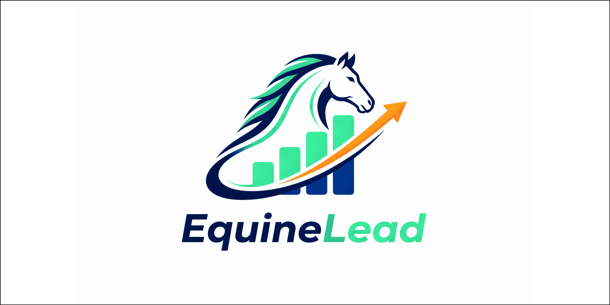
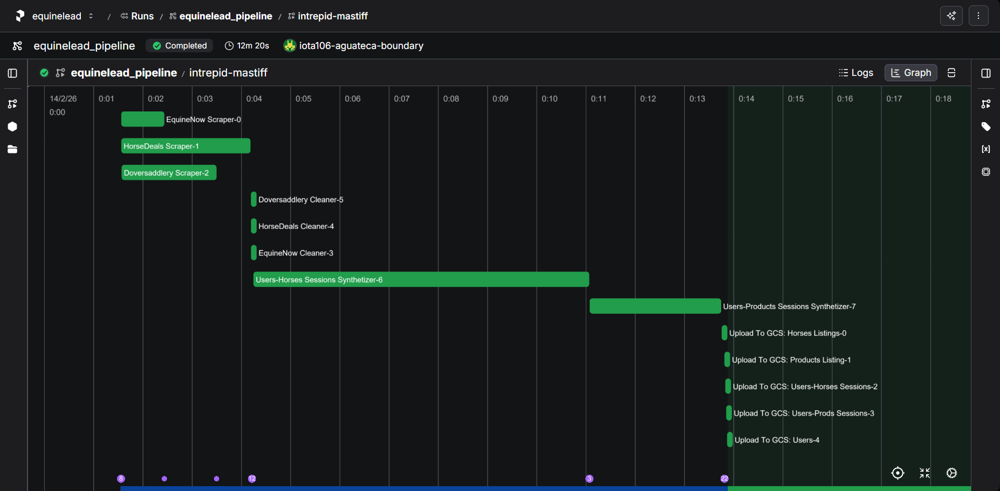
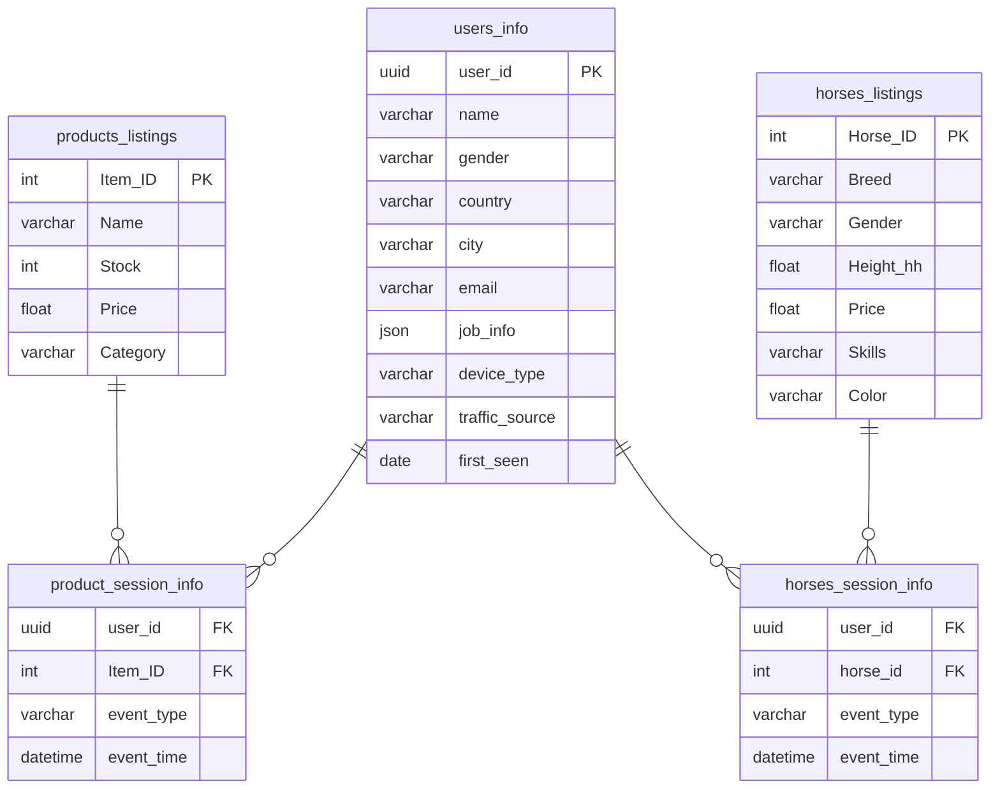
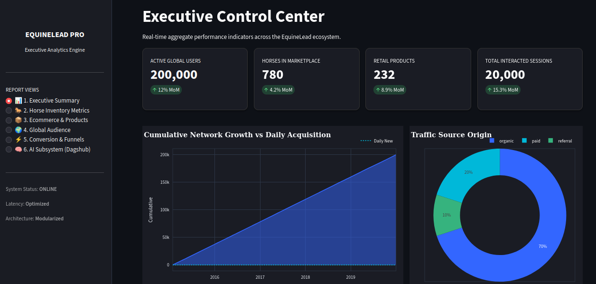
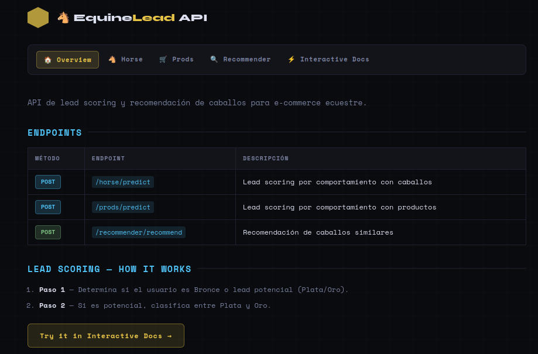
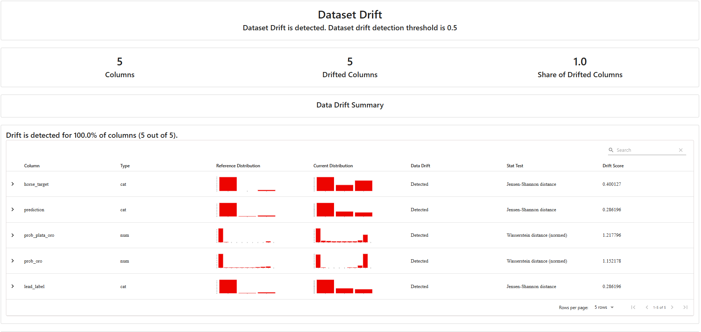
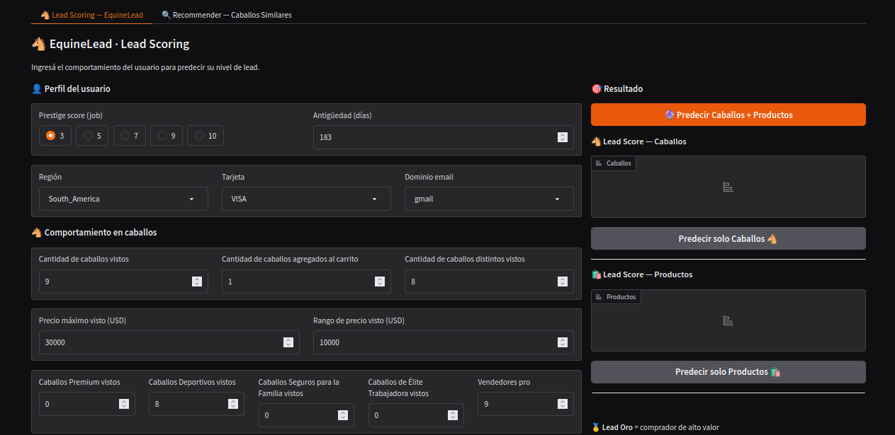
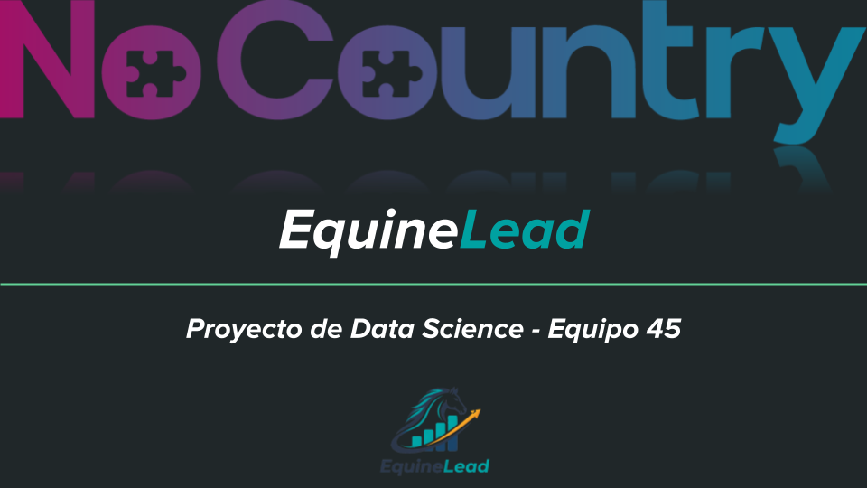

# EquineLead: Data-Driven Growth Engine for the Horse Industry


**EquineLead** es un sistema de inteligencia comercial diseñado para el mercado ecuestre, un nicho de alto ticket, altamente fragmentado, donde identificar a un comprador real entre miles de visitantes casuales es el principal cuello de botella del equipo de ventas.

El sistema analiza el comportamiento de navegación de cada usuario en tiempo real y lo clasifica automáticamente como Lead Bronce, Plata u Oro, sin formularios ni intervención manual. Complementado por un motor de recomendación que mantiene al usuario explorando productos de alto valor, y una API REST lista para integrarse con cualquier CRM o frontend existente.

Todo el pipeline, desde el scraping hasta el deploy, está orquestado, versionado y monitorado en producción.

---

## 🔗 Accesos Rápidos

| Entorno | URL | Descripción |
|---|---|---|
| 📊 **Dashboard Analytics** | [equinelead.streamlit.app](https://equinelead.streamlit.app/) | Executive Dashboard interactivo con KPIs, funnels y ML |
| ⚡ **API de Inferencia** | [equinelead-api](https://equinelead-api-516367992092.us-east1.run.app/) | REST API desplegada en Cloud Run para scoring en tiempo real |
| 🤗 **Demo de Modelos** | [HuggingFace Space](https://huggingface.co/spaces/Itrs/EquineLead-Models) | Demo interactivo del motor de recomendación y Lead Scoring |
| 📈 **Reporte de Monitoreo** | [equinelead-reports.netlify.app](https://equinelead-reports.netlify.app) | Reporte de monitoreo del pipeline y calidad de datos |
| 🧪 **Experiment Tracking & Model Registry** | [DagsHub](https://dagshub.com/aletbm/S02-26-E45-Data_Science_EquineLead) | Seguimiento de experimentos y registro de modelos con MLflow |

---

## 📖 Tabla de Contenidos

- [Definición del Problema](#-definición-del-problema)
- [Arquitectura y Stack](#️-arquitectura-del-sistema)
- [Pipeline de Datos](#-pipeline-de-datos-etlelt)
- [Modelos de ML](#-modelos-de-machine-learning)
  - [Lead Scoring en Cascada](#lead-scoring-en-cascada)
  - [Motor de Recomendación KNN](#motor-de-recomendación-knn)
- [Executive Dashboard](#-executive-dashboard)
- [API de Inferencia](#-api-de-inferencia)
  - [POST /horse/predict · /prods/predict](#post-horsepredict--prodspredict)
  - [POST /recommender/recommend](#post-recommenderrecommend)
- [Monitoreo](#-monitoreo-de-modelos-en-producción)
- [Demo Interactivo](#-demo-interactivo-huggingface)
- [Infraestructura (IaC)](#️-infraestructura-como-código-iac)
- [Quick Start](#-guía-de-ejecución-quick-start)
- [Estructura del Proyecto](#-estructura-del-proyecto)
- [Documentacion Adicional](#-documentacion-adicional)
- [Equipo](#-equipo-y-contribuciones)

---

## 🎯 Definición del Problema

### El Desafío

La industria ecuestre opera en un ecosistema nicho, altamente fragmentado y con costos de adquisición (CAC) elevados. Actualmente, identificar a un comprador de un caballo de salto de $50,000 frente a un entusiasta casual es una tarea manual e ineficiente.

### Objetivos del Proyecto

- **Identificación de Leads de Alto Valor:** Clasificar automáticamente usuarios en los cuatro verticales: Eventos, Servicios, Caballos y Equipamiento.
- **Reducción del Ciclo de Venta:** Acortar el tiempo entre el "interés inicial" y la "calificación (SQL)" mediante scoring predictivo.
- **Optimización de B2B y B2C:** Diferenciar el comportamiento de propietarios individuales frente a administradores de centros hípicos o mayoristas.

### KPIs de Éxito

| KPI | Descripción | Meta |
|---|---|---|
| **Lead Quality Score (LQS)** | Precisión del modelo para predecir conversión | > 80% |
| **CAC Reduction** | Reducción de costos de marketing mediante segmentación precisa | 15% |
| **F2 Lead Oro** | F2-score sobre la clase de mayor valor | ≥ 0.51 |
| **Conversion Rate (CVR)** | Mejora del flujo de ventas en caballos de alto valor | Incremento medible |

---

## 🛠️ Arquitectura del Sistema

El proyecto está diseñado bajo principios de **Modern Data Stack**, priorizando la velocidad de ejecución y la observabilidad.

### Stack Tecnológico

| Capa | Tecnología | Rol |
|---|---|---|
| **Orquestación** | Prefect 2 | Pipelines ETL y scheduling |
| **Entorno** | UV | Gestión de dependencias (70% más rápido que pip) |
| **Contenerización** | Docker & Docker Compose | Aislamiento de servicios |
| **Ingesta** | Playwright + BeautifulSoup4 + lxml | Scraping dinámico y estático |
| **Storage** | Google Cloud Storage | Data Lake en formato Parquet |
| **Versionado de Datos** | DVC + DagsHub | Trazabilidad de datasets |
| **ML Training** | XGBoost, LightGBM, CatBoost, scikit-learn | Modelado predictivo |
| **MLOps** | MLflow + DagsHub | Tracking de experimentos y artefactos |
| **Monitoring** | Evidently + Netlify + Slack Alerts | Monitoreo de modelos en produccion |
| **Serving** | FastAPI + Cloud Run | API REST de inferencia en producción |
| **Visualización** | Streamlit + Plotly | Dashboard ejecutivo |
| **IaC** | Terraform | Infraestructura reproducible en GCP |
| **Data Synthesis** | Faker + proyecciones Rees46 | Generación de comportamiento simulado |

---

## 🗺️ Diagrama de Flujo del Proyecto


El sistema integra siete etapas principales versionadas con **Git** y **DVC**:

1. **Ingest Data**: scraping, limpieza y síntesis de datos con Python/pandas/Faker.
2. **Data Control**: versionado de datasets con **DVC** para reproducibilidad total.
3. **Infrastructure**: recursos en GCP provisionados con **Terraform** (buckets, IAM, Cloud Run).
4. **EDA & Feature Engineering**: análisis exploratorio e ingeniería de variables con pandas, NumPy y scikit-learn.
5. **Training & Evaluation**: entrenamiento con XGBoost, LightGBM y optimización con **Optuna**. Tracking con **MLflow + DagsHub**.
6. **Deployment**: modelo containerizado con **Docker**, expuesto vía **FastAPI** en Cloud Run, con frontend en **Gradio/Streamlit**.
7. **Monitoring**: calidad del modelo con **Evidently AI**, alertas por **Slack** y reportes publicados en **Netlify**.

---

## 🔄 Pipeline de Datos (ETL/ELT)



### Ingesta y Scraping Paralelizado

El pipeline ejecuta múltiples scrapers de forma concurrente dentro de contenedores Docker:

- **Playwright:** Para la extracción de datos en sitios dinámicos (EquineNow — listings de caballos).
- **BeautifulSoup4 + lxml:** Para el procesamiento rápido de directorios estáticos (DoverSaddlery — productos ecuestres).

### Generación de Datos Sintéticos (Behavioral Tracking)

Para simular el comportamiento de usuario, se mapearon los eventos del dataset de [Rees46](https://www.kaggle.com/mkechinov/ecommerce-behavior-data-from-multi-category-store) a un entorno ecuestre:

- **Mapeo de Categorías:** Productos electrónicos/hogar → Sillas de Salto, Suplementos, Publicaciones.
- **Identidades con Faker:** Perfiles de usuarios únicos con historiales de navegación coherentes.
- **Proyección de Eventos:** Funnels de conversión `view → cart → purchase`.

### Diagrama Entidad-Relación (DER)


```mermaid
erDiagram
    products_listings ||--o{ product_session_info : ""
    users_info ||--o{ product_session_info : ""
    users_info ||--o{ horses_session_info : ""
    horses_listings ||--o{ horses_session_info : ""

    users_info {
        uuid user_id PK
        varchar name
        varchar gender
        varchar country
        varchar city
        varchar email
        json job_info
        varchar device_type
        varchar traffic_source
        date first_seen
    }

    horses_session_info {
        uuid user_id FK
        int horse_id FK
        varchar event_type
        datetime event_time
    }

    product_session_info {
        uuid user_id FK
        int Item_ID FK
        varchar event_type
        datetime event_time
    }

    horses_listings {
        int Horse_ID PK
        varchar Breed
        varchar Gender
        float Height_hh
        float Price
        varchar Skills
        varchar Color
    }

    products_listings {
        int Item_ID PK
        varchar Name
        int Stock
        float Price
        varchar Category
    }
```

### Descarga de Datos con DVC

Los datasets NO se almacenan en Git — se descargan bajo demanda:

```bash
# Autenticarse con Google Cloud
gcloud auth application-default login

# Descargar datos versionados
dvc pull
```

---

## 🧠 Modelos de Machine Learning

### Lead Scoring en Cascada

#### Definición de Targets

Los usuarios se clasifican en tres segmentos de forma **independiente** para dos verticales:

| Segmento | Criterio Caballos | Criterio Productos |
|---|---|---|
| 🥉 **Lead Bronce** | Sin compras | Sin compras |
| 🥈 **Lead Plata** | Compra < USD 50.000 | Compra < USD 2.000 |
| 🏆 **Lead Oro** | Compra ≥ USD 50.000 | Compra ≥ USD 2.000 |

#### Arquitectura en Cascada (2 clasificadores binarios)

```
Usuario
   │
   ▼
[Paso 1] ¿Tiene intención de compra?
    0 = Lead Bronce  →  FIN
    1 = Plata/Oro    →  continúa
              │
              ▼
         [Paso 2] ¿Es comprador de alto valor?
              0 = Lead Plata  →  FIN
              1 = Lead Oro    →  FIN
```

Esto genera **4 modelos**: `P1-horse`, `P1-prods`, `P2-horse`, `P2-prods`.

#### Feature Engineering Destacado

| Feature | Descripción | Señal |
|---|---|---|
| `max_horse_price_viewed` | Precio máximo explorado por el usuario | ⭐⭐⭐ |
| `max_visitas_mismo_caballo` | Revisitas a un mismo caballo | ⭐⭐⭐ |
| `horses_added_to_cart` | Acción de alta intención | ⭐⭐⭐ |
| `ratio_recurrencia_horse` | Concentración de revisitas | ⭐⭐ |
| `prestige_score` | Score laboral del usuario (1–10) | ⭐⭐ |
| `user_antiguedad_dias` | Madurez en la plataforma | ⭐⭐ |
| `viewed_sport_elite` | Interés en caballos FEI/dressage | ⭐⭐ |

#### Resultados del Modelo Campeón (XGB Tuneado)

| Target | F2 Macro | F2 Lead Oro | Gap Overfitting P2 |
|---|---|---|---|
| `horse_target` | ~0.48 | **~0.51** | ~0.10 |
| `prods_target` | ~0.47 | **~0.49** | ~0.11 |

Los experimentos completos están disponibles en DagsHub MLflow:
`https://dagshub.com/aletbm/S02-26-E45-Data_Science_EquineLead.mlflow`

#### Artefactos del Pipeline de Producción

| Artefacto | Descripción |
|---|---|
| `modelo_p1_horse.pkl` | Clasificador binario Bronce vs Plata/Oro (caballos) |
| `modelo_p2_horse.pkl` | Clasificador binario Plata vs Oro (caballos) |
| `modelo_p1_prods.pkl` | Clasificador binario Bronce vs Plata/Oro (productos) |
| `modelo_p2_prods.pkl` | Clasificador binario Plata vs Oro (productos) |
| `target_encoder.pkl` | TargetEncoder con smoothing=10 sobre X_train |
| `limites_capping.pkl` | Límites P99 por columna calculados sobre X_train |
| `cols_horse.pkl` | Lista de 27 features del dominio caballos |
| `cols_prods.pkl` | Lista de 22 features del dominio productos |

---

### Motor de Recomendación KNN

Un segundo sistema de IA basado en **K-Nearest Neighbors con Similitud de Coseno** para recomendar caballos similares:

- **NLP:** `TF-IDF Vectorizer` sobre razas y pelajes para procesar semántica.
- **Optimización de Memoria:** Matrices CSR (Compressed Sparse Row) para datos dispersos.
- **Precisión Promedio:** **74.65%** de similitud de coseno.

#### Features de Entrada para la API

| Variable | Tipo | Descripción |
|---|---|---|
| `price` | Float | Precio del caballo |
| `height_hh` | Float | Altura en hands high |
| `age` | Int | Edad en años |
| `breed` | Vectorized | Raza (procesada semánticamente) |
| `color` | Vectorized | Pelaje (procesado semánticamente) |

---

## 📊 Executive Dashboard

**[→ Acceder al Dashboard](https://equinelead.streamlit.app/)**



Dashboard modular construido con Streamlit y Plotly, con tema oscuro estilo Power BI. Organizado en 6 vistas:

| Vista | Contenido |
|---|---|
| 📊 **Executive Summary** | KPIs globales, crecimiento de usuarios, mapa de penetración |
| 🐎 **Horse Market Analytics** | Distribución de precios, razas, géneros, geografía |
| 📦 **Equestrian Retail Metrics** | Inventario, categorías, distribución de precios de productos |
| 🌍 **Global Audience** | Demografía, dispositivos, fuentes de tráfico, cohorts |
| ⚡ **Funnel & Session Telemetry** | Funnels de conversión, volumen de eventos, top items |
| 🧠 **AI Subsystem (DagsHub)** | Conexión en vivo a experimentos MLflow, métricas y plots |

### Ejecución Local

```bash
# Desde la raíz del repositorio
streamlit run app/app.py
```

---

## ⚡ API de Inferencia

→ [Acceder a la API](equinelead-api) · [Docs interactivos `/docs`](equinelead-api/docs)



REST API construida con **FastAPI**, desplegada como servicio serverless en **Google Cloud Run** y containerizada con **Docker**.

### Endpoints

| Endpoint | Descripción | Features |
|---|---|---|
| `POST /horse/predict` | Lead scoring vertical caballos | 27 features conductuales |
| `POST /prods/predict` | Lead scoring vertical productos | 22 features conductuales |
| `POST /recommender/recommend` | Recomendación KNN coseno | raza, color, precio |

---

### `POST /horse/predict` · `POST /prods/predict`

Clasifica al usuario en **Lead Bronce / Plata / Oro** mediante el pipeline en cascada.

**Request** `/horse/predict`
```json
{
  "features": {
    "horses_viewed": 42,
    "max_horse_price_viewed": 75000.0,
    "horses_added_to_cart": 3,
    "ratio_recurrencia_horse": 0.72,
    "user_prestige_score": 8,
    ...
  }
}
```

**Response**
```json
{
  "paso1": { "prob_bronce": 0.30, "prob_plata_oro": 0.70 },
  "paso2": { "prob_plata": 0.40, "prob_oro": 0.60 }
}
```

---

### `POST /recommender/recommend`

Devuelve los 5 caballos más similares. La distancia coseno va de **0** (idéntico) a **1** (completamente distinto).

**Request**
```json
{
  "breed": "andalusian",
  "color": "bay",
  "price": 22000.0
}
```

**Response**
```json
{
  "neighbors": [
    { "index": 142, "distance": 0.0 },
    { "index": 87,  "distance": 0.1423 },
    { "index": 210, "distance": 0.2105 }
  ]
}
```

---

### Despliegue
```bash
make test-api    # Build y run local (puerto 8080)
make deploy-api  # Build + push DockerHub + deploy Cloud Run
```

---

## 📡 Monitoreo de Modelos en Producción

**[→ Ver Reporte](https://equinelead-reports.netlify.app)**



El sistema de monitoreo detecta automáticamente degradación en los modelos desplegados comparando la distribución de datos de producción contra el dataset de entrenamiento.

### Flujo de Monitoreo
```
Datos de producción
        │
        ▼
[Evidently] Análisis de Data Drift
        │
        ├── Sin drift → Reporte publicado en Netlify
        │
        └── Drift detectado → Alerta automática en Slack + Reporte en Netlify
```

### ¿Qué se monitorea?

| Métrica | Descripción |
|---------|-------------|
| **Data Drift** | Cambios en la distribución de features clave vs. datos de entrenamiento |
| **Dataset Drift** | Proporción de features con drift significativo |
| **Class Balance** | Distribución de clases Lead Bronce / Plata / Oro |
| **Model Performance** | Accuracy y matriz de confusión sobre datos recientes |

### Ejecución Manual
```bash
# Correr reporte de monitoreo
uv run python src/monitoring/flow.py
```

El reporte se publica automáticamente en Netlify y si se detecta drift, se envía una alerta al canal de Slack del equipo.

---

## 🤗 Demo Interactivo (HuggingFace)

**[→ Acceder al Demo](https://huggingface.co/spaces/Itrs/EquineLead-Models)**



Interfaz Gradio alojada en HuggingFace Spaces que permite explorar el motor de recomendación KNN y el pipeline de Lead Scoring sin necesidad de configuración local. Ideal para demostraciones rápidas del modelo campeón.

---

## 🏗️ Infraestructura como Código (IaC)

Para garantizar la reproducibilidad total, la infraestructura de la nube se gestiona mediante **Terraform**. Todo el entorno GCP se crea y destruye con un solo comando, sin configuración manual.

### Recursos Provisionados

| Recurso | Descripción |
|---------|-------------|
| `google_storage_bucket` | Data Lake en GCS para datasets y artefactos |
| `google_service_account` | Cuenta de servicio con permisos de Storage Admin |
| `google_service_account_key` | Key JSON para autenticación desde el pipeline |
| `google_cloud_run_v2_service` | API FastAPI desplegada como servicio serverless |
| `google_cloud_run_v2_service_iam_member` | Acceso público al endpoint de Cloud Run |

### Configuración Inicial
```bash
# 1. Autenticarse en GCP
gcloud auth application-default login

# 2. Verificar y setear el proyecto activo
gcloud config get-value project
gcloud config set project TU_PROJECT_ID

# 3. Habilitar las APIs necesarias
gcloud services enable iam.googleapis.com
gcloud services enable storage-api.googleapis.com
gcloud services enable run.googleapis.com

# 4. Crear infra/terraform/terraform.tfvars
project_id           = "tu-id-de-proyecto"
region               = "us-east1"
bucket_name          = "equinelead-datalake"
storage_class        = "STANDARD"
service_account_name = "your-service-account-name"
image                = "docker.io/usuario/equinelead-api:latest"
```

### Despliegue
```bash
# Desplegar toda la infraestructura
make terraform-deploy

# Desplegar solo el bucket de GCS
make terraform-datalake

# Desplegar solo el servicio de Cloud Run
make terraform-api

# ⚠️ Destruir toda la infraestructura
make terraform-destroy
```

### Extraer Service Account Key

Después del deploy, exportá la key para usarla en el pipeline y en GitHub Actions:
```powershell
# PowerShell
$rawKey = terraform -chdir=infra/terraform output -raw service_account_key
[System.Text.Encoding]::UTF8.GetString([System.Convert]::FromBase64String($rawKey)) | Out-File -FilePath "./secrets/gcp-sa-key.json" -Encoding ascii
```
```bash
# Bash / Linux / Mac
terraform -chdir=infra/terraform output -raw service_account_key | base64 --decode > ./secrets/gcp-sa-key.json
```

> ⚠️ El archivo `gcp-sa-key.json` contiene credenciales sensibles. Nunca lo subas al repositorio — está incluido en `.gitignore`.

---

## 🚀 Guía de Ejecución (Quick Start)

> **Requisitos:** Docker, gcloud CLI, y cuenta en Prefect Cloud (opcional).

### 1. Clonar el repositorio
```bash
git clone https://github.com/No-Country-simulation/S02-26-E45-Data_Science_EquineLead
cd S02-26-E45-Data_Science_EquineLead
```

### 2. Configurar variables de entorno
```bash
# Crear .env con credenciales

# Google Cloud
GCP_PROJECT_ID=tu_id_proyecto
GCP_BUCKET_NAME=tu_nombre_bucket
GOOGLE_APPLICATION_CREDENTIALS=path_to_credentials.json

# Prefect
PREFECT_API_URL="https://api.prefect.cloud/api/accounts/[ID]/workspaces/[ID]"
PREFECT_API_KEY=your_prefect_api_key

# DagsHub / MLflow
DAGSHUB_USER_TOKEN=your_dagshub_token

# Docker
DOCKER_USERNAME=your_dockerhub_username
DOCKER_PASSWORD=your_dockerhub_password

# Monitoring
SLACK_WEBHOOK_URL=your_slack_webhook_url
NETLIFY_TOKEN=your_netlify_token
NETLIFY_SITE_ID=your_netlify_site_id
```

> 💡 **Dónde obtener cada credencial:**
> - `GCP`: [Google Cloud Console](https://console.cloud.google.com/)
> - `PREFECT_API_KEY`: [Prefect Cloud](https://app.prefect.cloud/) → Settings → API Keys
> - `DAGSHUB_USER_TOKEN`: [DagsHub](https://dagshub.com/) → Settings → Access Tokens
> - `DOCKER_USERNAME`: tu usuario de [Docker Hub](https://hub.docker.com/)
> - `DOCKER_PASSWORD`: tu PAT en [Docker Hub](https://hub.docker.com/) → Account Settings → Personal Access Token
> - `SLACK_WEBHOOK_URL`: Slack → Apps → Incoming Webhooks
> - `NETLIFY_TOKEN`: [Netlify](https://app.netlify.com/) → User Settings → Applications → Personal access tokens

### 3. Instalar dependencias (UV)
```bash
pip install uv
uv sync --all-groups
```

### 4. Descargar los datos
```bash
gcloud auth application-default login
dvc pull
```

### 5. Opciones de ejecución

| Comando | Descripción |
|---------|-------------|
| **📦 Entorno** | |
| `make install-all` | Instala todas las dependencias con UV |
| `make lint` | Corre black + ruff sobre todo el repo via pre-commit |
| **📊 App & Servicios** | |
| `make run-app` | Levanta el dashboard de Streamlit en puerto 8520 |
| `make run-prefect` | Levanta el servidor de Prefect via Docker Compose |
| **🔄 Data Pipeline** | |
| `make run-data-pipeline` | Pipeline completo de ingesta en Docker (scraping → limpieza → síntesis) |
| `make run-etl` | Pipeline ETL directamente con Python, sin Docker |
| `make dvc-pull` | Descarga los datasets versionados desde GCS |
| `make dvc-push` | Sube los datasets locales a GCS |
| **🧠 Training** | |
| `make train-leads` | Entrena el modelo de Lead Scoring en cascada (XGBoost) |
| `make train-engine` | Entrena el motor de recomendación KNN coseno |
| **📋 Model Registry** | |
| `make download-models` | Descarga los modelos con alias `@production` desde DagsHub |
| `make register-models` | Registra los modelos entrenados en MLflow Model Registry |
| `make promote-models` | Promueve un modelo al alias `@production` |
| **📡 Monitoring** | |
| `make run-monitoring` | Genera reporte de drift con Evidently, publica en Netlify y alerta en Slack |
| **🚀 API** | |
| `make test-api` | Buildea y corre la API localmente en puerto 8080 |
| `make deploy-api` | Build + push a DockerHub + deploy en Cloud Run via Cloud Build |
| **🏗️ Infraestructura** | |
| `make terraform-deploy` | Despliega toda la infraestructura GCP (init + validate + plan + apply) |
| `make terraform-datalake` | Despliega solo el bucket de GCS |
| `make terraform-api` | Despliega solo el servicio de Cloud Run |
| `make terraform-destroy` | ⚠️ Destruye toda la infraestructura GCP |

---

## 📁 Estructura del Proyecto
```
S02-26-E45-Data_Science_EquineLead/
├── .github/workflows/ci.yml        # Pipeline de CI: linting y tests automáticos en cada push
├── .pre-commit-config.yaml         # Hooks de pre-commit (black, ruff) para mantener calidad de código
├── Makefile                        # Comandos útiles: levantar servicios, correr pipelines, etc.
├── pyproject.toml                  # Configuración del proyecto y dependencias (uv)
├── uv.lock                         # Lockfile de dependencias para reproducibilidad
│
├── app/                            # Dashboard interactivo en Streamlit
│   ├── app.py                      # Entry point del dashboard
│   ├── components/                 # Componentes reutilizables de UI (charts, cards, filtros)
│   ├── modules/                    # Páginas del dashboard (audiencia, conversión, caballos, etc.)
│   ├── utils/                      # Carga de datos y estilos
│   └── requirements.txt            # Dependencias específicas para Streamlit Cloud
│
├── assets/                         # Imágenes y recursos visuales del proyecto
│
├── data/                           # Punteros DVC a los datasets en GCS
│   ├── clean.dvc                   # Dataset limpio versionado
│   ├── raw.dvc                     # Dataset crudo versionado
│   ├── production.dvc              # Dataset de producción versionado
│   └── tracking/                   # Archivos auxiliares para generación de datos sintéticos
│
├── deployment/                     # Todo lo necesario para containerizar y deployar
│   ├── Dockerfile.api              # Imagen Docker de la API FastAPI
│   ├── Dockerfile.data_pipeline    # Imagen Docker del pipeline de datos
│   ├── docker-compose.yml          # Orquestación local de servicios
│   └── entrypoints/                # Scripts de entrada para los containers
│
├── docs/                           # Documentación técnica y de negocio del proyecto
│
├── infra/terraform/                # Infraestructura como código (IaC)
│   ├── main.tf                     # Recursos GCP: Storage, IAM, Cloud Run
│   ├── variables.tf                # Variables de configuración
│   └── providers.tf                # Provider de Google Cloud
│
└── src/                            # Código fuente principal
    ├── api/                        # API REST con FastAPI
    │   ├── main.py                 # Entry point de la API
    │   ├── routers/                # Endpoints: /horse/predict, /prods/predict, /recommender/recommend
    │   ├── schemas.py              # Modelos Pydantic para validación de requests
    │   ├── docs/                   # Documentación interactiva de cada endpoint
    │   └── utils.py                # Funciones auxiliares de la API
    │
    ├── cleaning/                   # Scripts de limpieza de datos por fuente
    │
    ├── experiments/                # Código de entrenamiento de modelos
    │   ├── engine/                 # Motor de recomendación (KNN coseno)
    │   └── leads/                  # Modelo de scoring de leads (XGBoost en cascada)
    │
    ├── flows/etl/                  # Pipeline de ingesta orquestado con Prefect
    │
    ├── misc/                       # Configuración global y utilidades compartidas
    │
    ├── monitoring/                 # Monitoreo de modelos en producción con Evidently
    │   ├── flow.py                 # Orquestación del reporte de drift
    │   ├── slack_alerts.py         # Alertas automáticas a Slack si se detecta drift
    │   └── netlify_deploy.py       # Publicación automática del reporte en Netlify
    │
    ├── notebooks/                  # Experimentación y análisis exploratorio
    │   ├── cleaning/               # Notebooks de limpieza por fuente de datos
    │   ├── engine/                 # Notebooks del motor de recomendación
    │   ├── leads/                  # Notebooks de lead scoring
    │   └── synthetizing/           # Notebooks de generación de datos sintéticos
    │
    ├── registry/                   # Scripts para gestión del MLflow Model Registry
    │   ├── download_production_models.py  # Descarga modelos con alias @production
    │   └── promote_to_production.py       # Promueve un modelo al registry
    │
    ├── scraping/                   # Scrapers por fuente (EquineNow, DoverSaddlery, HorseDeals)
    │
    └── synthetizing/               # Generación de datos sintéticos de comportamiento de usuarios
```

---

## 📚 Documentacion Adicional

### Docs

| Documento | Descripción |
|---|---|
| [LeadScoring_Documentacion.md](./docs/LeadScoring_Documentacion.md) | Documentación técnica completa del modelo de Lead Scoring |
| [README_MOTOR_RECOMENDACION.md](./docs/README_MOTOR_RECOMENDACION.md) | Motor de recomendación KNN — descripción y resultados |
| [data-description.md](./docs/data-description.md) | Descripción detallada de todos los datasets |
| [deploy_app.md](./docs/deploy_app.md) | Guía de despliegue del Dashboard (local, Cloud, Docker) |
| [how-to-download-with-DVC.md](./docs/how-to-download-with-DVC.md) | Gestión de datasets con DVC + GCS |
| [how-can-i-use-MLFlow-Tracking.md](./docs/how-can-i-use-MLFlow-Tracking-Experiment-on-Dagshub.md) | Tutorial de tracking de experimentos con MLflow y DagsHub |
| [PipelineInferenciaCascada.html](./docs/PipelineInferenciaCascada.html) | Diagrama visual del pipeline de inferencia |

### Video del demo Day

[](https://www.youtube.com/watch?v=EMtkNVQexdI)

---

## 👥 Equipo y Contribuciones

| Nombre | Rol | LinkedIn |
|--------|-----|----------|
| **Alexander Rios** | Data Scientist & ML Engineer | [linkedin.com/in/alexander-daniel-rios](https://www.linkedin.com/in/alexander-daniel-rios/) |
| **Daisy Quinteros** | Data Engineer & Data Scientist | [linkedin.com/in/daisy-quinteros-silva-5b0450a5](https://www.linkedin.com/in/daisy-quinteros-silva-5b0450a5) |
| **Iñaki Rosello** | Data Scientist & ML Engineer | [linkedin.com/in/iñakirosellosignoris](https://www.linkedin.com/in/iñakirosellosignoris) |
| **Dody Dueñas** | Data Analyst | [linkedin.com/in/dody-dueñas-remache-079164296](https://www.linkedin.com/in/dody-dueñas-remache-079164296/) |

Este proyecto fue desarrollado en el marco de la simulación laboral **No Country — S02-26-E45** por un equipo multidisciplinario de Data Science.

**Roles cubiertos:** Data Engineering · Machine Learning Engineering · Data Science · Data Analytics · MLOps · Backend API

---

*EquineLead — Transformando el mercado ecuestre con inteligencia de datos.*
