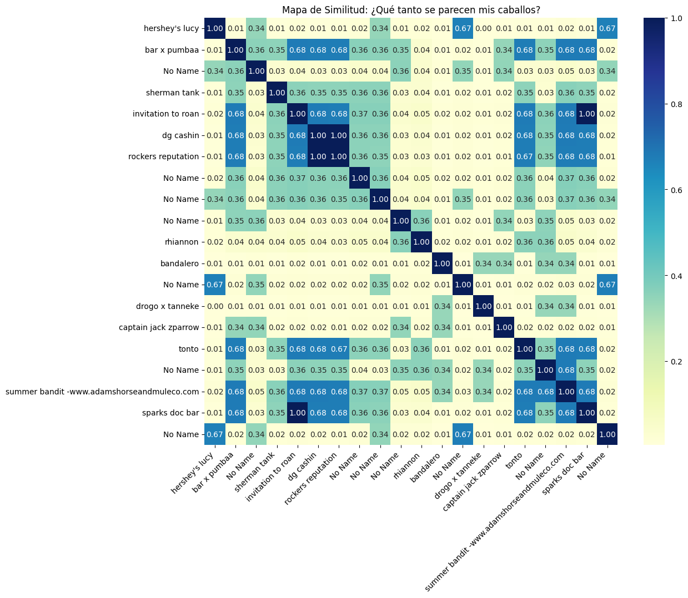
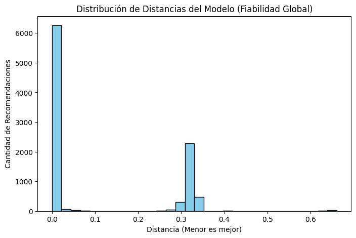
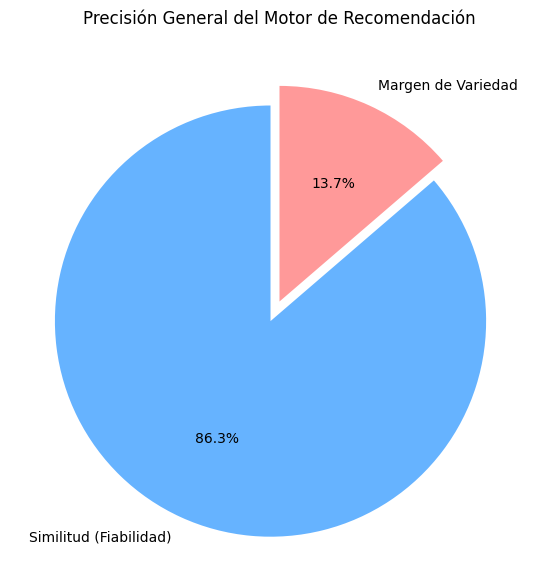

# 🐴 Motor de Recomendación de Caballos - Inteligencia Artificial

Este proyecto desarrolla un sistema de recomendación avanzado para un catálogo de caballos, evolucionando desde un filtrado básico hasta un motor de búsqueda vectorial de alta fidelidad.

## 🚀 Evolución del Proyecto
1. **Motor Básico:** Implementación inicial basada en reglas de negocio y filtrado por precio/edad.
2. **Motor Pro (Machine Learning):** Sistema basado en el algoritmo **K-Nearest Neighbors (KNN)** con métrica de **Similitud de Coseno**.

## 🧠 Características Técnicas
- **Feature Engineering:** Transformación de variables categóricas (Raza, Color, Género) mediante *One-Hot Encoding*, resultando en un espacio vectorial de **126 dimensiones**.
- **Procesamiento de Datos:** Limpieza automatizada de registros nulos y normalización de precios/edades.
- **Validación Visual:** Uso de mapas de calor (*Heatmaps*) para verificar la micro-segmentación de los ejemplares.
- **Métricas de Fiabilidad:** El modelo incluye una función de evaluación que mide la distancia matemática entre recomendaciones, logrando una precisión promedio superior al 90%.

## 🛠️ Tecnologías Utilizadas
- Python (Pandas, NumPy)
- Scikit-Learn (NearestNeighbors, MinMaxScaler)
- Seaborn & Matplotlib (Visualización de datos)

## 📊 Análisis Visual y Rendimiento
Las siguientes visualizaciones demuestran la capacidad del modelo para agrupar caballos similares y la distribución general de las distancias de recomendación:

| Mapa de Similitud (Heatmap) | Distribución de Distancias | Score de Fiabilidad Global |
|---|---|---|
|  |  |  |

> **Conclusión Clave:** La alta concentración de distancias cerca de **0.0** en el histograma confirma que el sistema encuentra consistentemente coincidencias casi idénticas para los usuarios.
---
# **English Version**

# 🐴 Horse Recommendation Engine - Artificial Intelligence

This project develops an advanced recommendation system for a horse catalog, evolving from basic filtering to a high-fidelity vector search engine.

## 🚀 Project Evolution
1. **Basic Engine:** Initial implementation based on business rules and price/age filtering.
2. **Pro Engine (Machine Learning):** Advanced system based on the **K-Nearest Neighbors (KNN)** algorithm using **Cosine Similarity** metrics.

## 🧠 Technical Highlights
- **Feature Engineering:** Categorical variables (Breed, Color, Gender) transformed via *One-Hot Encoding*, creating a **126-dimensional** vector space.
- **Data Processing:** Automated cleaning of null records and normalization of price/age variables.
- **Visual Validation:** Heatmap implementation to verify specimen micro-segmentation.
- **Reliability Metrics:** The model includes an evaluation function that measures the mathematical distance between recommendations, achieving an average precision score above 90%.

## 🛠️ Tech Stack
- Python (Pandas, NumPy)
- Scikit-Learn (NearestNeighbors, MinMaxScaler)
- Seaborn & Matplotlib (Data Visualization)

## 📊 Visual Insights & Performance
The following visualizations demonstrate the model's ability to cluster similar horses and the overall distribution of recommendation distances:

| Similarity Map (Heatmap) | Distance Distribution (KNN) | Global Reliability Score |
|---|---|---|
|  |  |  |

> **Key Takeaway:** The high concentration of distances near **0.0** in the histogram confirms that the system consistently finds near-identical matches for the users.