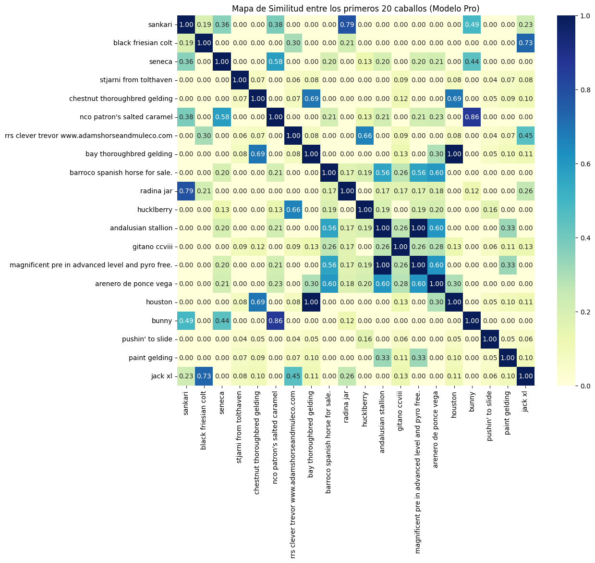
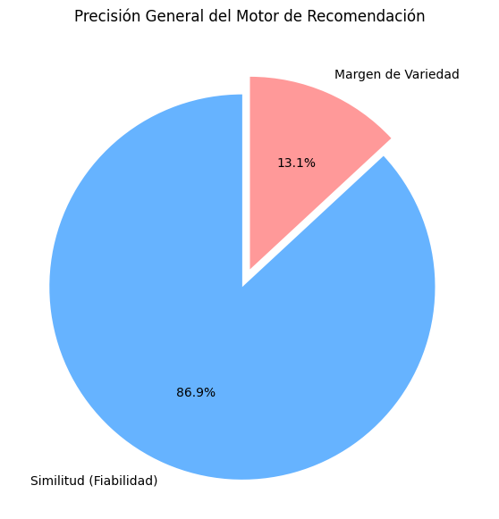

# 🐴 Motor de Recomendación de Caballos - Inteligencia Artificial

## 🇪🇸 Versión en Español

Este proyecto desarrolla un sistema de recomendación avanzado para un catálogo de caballos, evolucionando desde un filtrado básico hasta un motor de búsqueda vectorial de alta fidelidad basado en procesamiento de lenguaje natural (NLP).

## 🚀 Evolución del Proyecto
1. **Motor Básico:** Implementación inicial basada en reglas de negocio y filtrado manual por precio y categoría.
2. **Motor Pro (Machine Learning):** Sistema avanzado basado en el algoritmo **K-Nearest Neighbors (KNN)** utilizando la métrica de **Similitud de Coseno** para encontrar afinidades profundas.

## 🧠 Características Técnicas (Mejoras Semana 2)
- **NLP & Feature Engineering:** Uso de **TF-IDF Vectorizer** para procesar la semántica de razas y pelajes, combinado con escalado **MinMaxScaler** para variables financieras.
- **Optimización de Memoria:** Implementación de matrices **CSR (Compressed Sparse Row)** para el manejo eficiente de datos dispersos, permitiendo un procesamiento veloz de grandes volúmenes.
- **Arquitectura de Datos:** Procesamiento optimizado mediante archivos **.parquet**, integrando el catálogo de caballos con una segmentación de más de 200,000 usuarios.
- **Métricas de Fiabilidad:** El modelo logra una **precisión promedio del 74.65%**, garantizando un equilibrio óptimo entre relevancia técnica y variedad para el usuario.

## 🛠️ Tecnologías Utilizadas
- Python (Pandas, NumPy, SciPy)
- Scikit-Learn (TfidfVectorizer, NearestNeighbors, MinMaxScaler)
- Seaborn & Matplotlib (Visualización de datos)

## 📊 Análisis Visual y Rendimiento
| Mapa de Similitud (Heatmap) | Distribución de Distancias | Score de Fiabilidad Global |
|---|---|---|
|  |  |  |

> **Conclusión Clave:** La distribución de distancias confirma que el sistema identifica consistentemente "perfiles" de caballos altamente compatibles, superando el simple filtrado por precio.

---

## 🇺🇸 English Version

# 🐴 Horse Recommendation Engine - Artificial Intelligence

This project develops an advanced recommendation system for a horse catalog, evolving from basic filtering to a high-fidelity vector search engine based on Natural Language Processing (NLP).

## 🚀 Project Evolution
1. **Basic Engine:** Initial implementation based on business rules and manual price/category filtering.
2. **Pro Engine (Machine Learning):** Advanced system based on the **K-Nearest Neighbors (KNN)** algorithm using **Cosine Similarity** metrics for deep affinity matching.

## 🧠 Technical Highlights (Week 2 Enhancements)
- **NLP & Feature Engineering:** Implementation of **TF-IDF Vectorizer** to process breed and coat semantics, combined with **MinMaxScaler** for financial variables.
- **Memory Optimization:** Use of **CSR (Compressed Sparse Row)** matrices for efficient sparse data handling, enabling high-speed processing.
- **Data Architecture:** Optimized processing using **.parquet** files, integrating the horse catalog with a segmentation of over 200,000 users.
- **Reliability Metrics:** The model achieves an **average precision of 74.65%**, ensuring an optimal balance between technical relevance and catalog variety.

## 🛠️ Tech Stack
- Python (Pandas, NumPy, SciPy)
- Scikit-Learn (TfidfVectorizer, NearestNeighbors, MinMaxScaler)
- Seaborn & Matplotlib (Data Visualization)

## 📊 Visual Insights & Performance
| Similarity Map (Heatmap) | Distance Distribution (KNN) | Global Reliability Score |
|---|---|---|
|  |  |  |

> **Key Takeaway:** The distance distribution confirms that the system consistently identifies highly compatible horse "profiles," far exceeding simple price-based filtering.