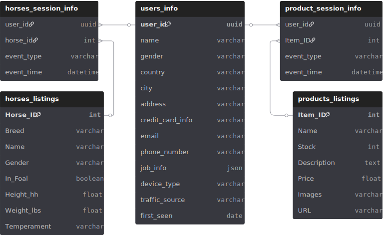

# Datos

Este repositorio contiene múltiples datasets relacionados con **caballos, usuarios, productos ecuestres y eventos de interacción**. Los datos incluyen tanto información real (productos y listings) como datos sintéticos (usuarios y eventos) para análisis, pruebas de modelos y simulaciones.

---

## Estructura de la carpeta `data`

El repositorio contiene los datos organizados en tres carpetas principales: `raw`, `clean` y `tracking`.

```
data/
│   README.md
│
├───clean
│       horses_listings_limpio.parquet        # Dataset limpio de caballos (Horse Listings)
│       horses_sessions_info.parquet          # Eventos de interacción usuario-caballo (limpio)
│       prods_sessions_info.parquet           # Eventos de interacción usuario-producto (limpio)
│       products_listing_limpio.parquet       # Dataset limpio de productos ecuestres
│       users_info.parquet                     # Información sintética de usuarios
│
├───raw
│       doversaddlery_products_listing.parquet  # Dataset original de productos reales de Doversaddlery
│       equinenow_horses_listings.parquet       # Dataset original de anuncios de caballos de EquineNow
│       horsedeals_horses_listings.parquet     # Dataset original de anuncios de caballos de HorseDeals
│
└───tracking
        equestrian_jobs.txt   # Listado de trabajos ecuestres extraído de la web
        locale.txt            # Información de localización de paises
```

### Notas sobre la organización

* `raw/`: Contiene los datasets originales, sin limpieza ni transformación. Incluye información real y datos extraídos de fuentes web.
* `clean/`: Contiene datasets procesados y listos para análisis, con limpieza, normalización y consistencia.
* `tracking/`: Archivos auxiliares que registran información de scraping o de localización de datos.

---
# Diagrama Entidad-Relación (DER)



---

# Horse Listings Dataset – Feature Description

Archivo: `data/clean/horses_listings_limpio.parquet`

Este dataset contiene información estructurada y textual sobre anuncios de caballos publicados en plataformas de compra/venta (**EquineNow** y **HorseDeals**). Cada fila representa un caballo único identificado por un anuncio.

> ⚠️ Todos los datos fueron extraídos de las webs EquineNow y HorseDeals. El uso debe respetar derechos de autor, términos de uso del sitio y buenas prácticas de web scraping.

## Descripción de Features

| Feature              | Tipo de dato | Descripción |
|----------------------|--------------|-------------|
| Horse_ID             | Integer      | Identificador único del anuncio del caballo en la plataforma de origen. |
| Breed                | Categorical  | Raza del caballo (ej.: quarter horse, miniature, draft, standardbred). |
| Name                 | Text         | Nombre del caballo según el anuncio. Puede contener valores faltantes (`sin información`). |
| Gender               | Categorical  | Sexo del caballo (gelding, filly, mare, stallion, etc.). |
| In Foal              | Boolean      | Indica si la yegua está preñada (`yes` / `no`). |
| Height (hh)          | Float        | Altura del caballo en *hands high (hh)*. 1 hh = 4 pulgadas. |
| Weight (lbs)         | Float        | Peso aproximado del caballo en libras (lbs). |
| Temperament          | Categorical / Ordinal | Puntaje de temperamento reportado en el anuncio (escala típica 1–10). |
| Ad Created           | Date         | Fecha de creación del anuncio. |
| Last Update          | Date         | Fecha de la última actualización del anuncio. |
| Location             | Categorical  | Ciudad y estado donde se encuentra el caballo. |
| Price                | Float        | Precio del caballo en dólares estadounidenses (USD). |
| Horse Profile        | URL          | Enlace al perfil completo del caballo en la plataforma. |
| Skills               | Text         | Habilidades o disciplinas del caballo (ej.: trail, ranch work, beginner friendly). |
| Comments             | Text         | Descripción libre del caballo escrita por el vendedor. |
| Shipping             | Text         | Información sobre opciones de envío o transporte. |
| Company Name         | Categorical  | Nombre del criadero, rancho o vendedor. |
| Company Profile      | URL          | Enlace al perfil del vendedor o empresa. |
| Color                | Categorical  | Color del pelaje del caballo (bay, chestnut, buckskin, etc.). |
| Registry             | Categorical  | Registro oficial del caballo (AQHA, USTA, etc.). |
| Markings             | Text         | Marcas distintivas o patrones físicos del caballo. |
| Age                  | Float        | Edad del caballo en años (puede ser decimal). |
| Has_Face_Markings    | Boolean      | Indica si el caballo tiene marcas faciales (`1` = sí, `0` = no). |

## Notas

- El dataset combina variables **numéricas**, **categóricas**, **booleanas** y **texto libre**.
- Existen valores faltantes representados como `sin información`.
- El uso debe ser **responsable y ético**, respetando copyright, términos de servicio del sitio y buenas prácticas de scraping.
- Es adecuado para tareas de **análisis exploratorio**, **modelos de pricing**, **clasificación**, **NLP** y **recomendación**.

---

# Equestrian Items Dataset – Feature Description

Archivo: `data/clean/products_listing_limpio.parquet`

Este dataset contiene información real sobre productos ecuestres disponibles en la tienda en línea **Doversaddlery**. Cada fila representa un artículo único, incluyendo información de stock, descripción, precio e imágenes.

> ⚠️ Todos los datos fueron extraídos de la web de Doversaddlery. El uso debe respetar derechos de autor, términos de uso del sitio y buenas prácticas de web scraping.

## Descripción de Features

| Feature     | Tipo de dato | Descripción |
|-------------|--------------|-------------|
| Item_ID     | Integer      | Identificador único del producto en el catálogo de Doversaddlery. |
| Name        | Text         | Nombre del artículo o producto. |
| Stock       | Integer      | Cantidad disponible en inventario según la web al momento de la extracción. |
| Description | Text         | Descripción detallada del producto, tal como aparece en la web. |
| Price       | Float        | Precio del producto en dólares estadounidenses (USD). |
| Images      | URL / Text   | Enlaces a las imágenes del producto publicadas en la web. Puede contener uno o varios URLs. |
| URL         | URL          | Enlace a la página del producto en Doversaddlery. |
| Category.   | Text.        | Categoria del producto

## Notas

- El dataset puede incluir productos fuera de stock (`Stock = 0`) para reflejar disponibilidad actualizada.
- El uso debe ser **responsable y ético**, respetando copyright, términos de servicio del sitio y buenas prácticas de scraping.
- Este dataset es útil para análisis de **catálogo de productos**, **pricing**, **gestión de inventario**, **recomendadores de productos** y **visualización de ecommerce**.

---

# User Dataset – Feature Description

Archivo: `data/clean/users_info.parquet`

Este dataset contiene información sintética sobre usuarios registrados en una plataforma digital, incluyendo datos demográficos, de contacto, adquisición y uso del sistema. Cada fila representa un usuario único identificado por un `user_id`.  

> ⚠️ Todos los datos son **sintéticos** y no corresponden a personas reales.

## Descripción de Features

| Feature             | Tipo de dato | Descripción |
|---------------------|--------------|-------------|
| user_id             | UUID / String | Identificador único del usuario. |
| name                | Text         | Nombre completo del usuario. |
| gender              | Categorical  | Género del usuario (male, female, etc.). |
| country             | Categorical  | País de residencia del usuario. |
| city                | Categorical  | Ciudad del usuario. |
| addres              | Text         | Dirección física del usuario. Puede contener formato libre. |
| credit_card_info    | Text (Sensitive) | Información de tarjeta de crédito en formato texto. Contiene datos sensibles (marca, nombre, número parcial, expiración). |
| email               | Text         | Dirección de correo electrónico del usuario. |
| phone_number        | Text         | Número de teléfono del usuario. Puede incluir prefijo internacional y extensiones. |
| job_info            | JSON / Text  | Información laboral del usuario en formato JSON (empresa, cargo, sufijo legal, etc.). |
| device_type         | Categorical  | Tipo de dispositivo utilizado por el usuario (mobile, desktop, etc.). |
| traffic_source      | Categorical  | Fuente de adquisición del usuario (organic, paid, referral, etc.). |
| first_seen          | Date         | Fecha en la que el usuario fue visto por primera vez en el sistema. |

## Notas

- Todos los datos son **sintéticos**, por lo que **no representan personas reales** y pueden usarse libremente para análisis, ML y demostraciones. Sin embargo, deben aplicarse prácticas de protección de datos, ya que si bien son datos sinteticos, en un proyecto real el dataset representara **información personal sensible (PII)** como emails, direcciones, teléfonos y datos de tarjetas de crédito la cuales **no son aptas para uso directo en modelos de machine learning** y deberían eliminarse, anonimizarse o tokenizarse por motivos legales y de compliance.
- `job_info` se presenta en formato JSON/texto y puede normalizarse para análisis estadísticos.
- Existen variaciones de formato en `phone_number` y `addres` para simular diversidad geográfica.
- El dataset es adecuado para análisis de **adquisición de usuarios**, **segmentación**, **atribución de tráfico** y **análisis de comportamiento**.

---

# User-Horse Event Dataset – Feature Description

Archivo: `data/clean/horses_sessions_info.parquet`

Este dataset contiene información sintética sobre eventos de interacción de usuarios con caballos dentro de una plataforma digital (por ejemplo, un marketplace o portal de adopción/venta de caballos). Cada fila representa un evento individual generado por un usuario sobre un caballo durante una sesión.  

> ⚠️ Todos los datos son **sintéticos** y no corresponden a usuarios ni caballos reales.

## Descripción de Features

| Feature        | Tipo de dato | Descripción |
|----------------|--------------|-------------|
| user_id        | UUID / String | Identificador único del usuario que generó el evento. |
| user_session   | UUID / String | Identificador único de la sesión del usuario. Cada sesión puede contener múltiples eventos. |
| horse_id       | Integer / String | Identificador del caballo con el que interactuó el usuario (corresponde al `Horse_ID` del dataset de caballos). |
| event_type     | Categorical  | Tipo de evento registrado (ej.: `view`, `favorite`, `inquiry`). |
| event_time     | Timestamp    | Fecha y hora del evento en formato UTC (`YYYY-MM-DD HH:MM:SS UTC`). |

## Notas

- Todos los datos son **sintéticos**, por lo que **no representan usuarios ni caballos reales**.
- Este dataset es útil para **análisis de comportamiento de usuarios**, **recomendadores de caballos**, **seguimiento de popularidad de caballos** y **pruebas de pipelines de datos**.
- `user_session` permite agrupar eventos por sesión para reconstruir flujos de navegación.
- `event_time` está en formato UTC; puede ser convertido a zona horaria local si se requiere análisis temporal.
- `horse_id` puede vincularse con el dataset de **Horse Listings** para enriquecer análisis de comportamiento con atributos del caballo.

---

# User-Product Dataset – Feature Description

Archivo: `data/clean/prods_sessions_info.parquet`

Este dataset contiene información sintética sobre eventos de interacción de usuarios con productos equestres dentro de una plataforma digital (por ejemplo, e-commerce o aplicación web). Cada fila representa un evento individual generado por un usuario durante una sesión.

> ⚠️ Todos los datos son **sintéticos** y no corresponden a usuarios reales ni a eventos reales.

## Descripción de Features

| Feature        | Tipo de dato | Descripción |
|----------------|--------------|-------------|
| user_id        | Integer / String | Identificador único del usuario que generó el evento. |
| user_session   | UUID / String | Identificador único de la sesión del usuario. Cada sesión puede contener múltiples eventos. |
| item_id        | UUID / String | Identificador del ítem o producto con el que interactuó el usuario. |
| event_type     | Categorical  | Tipo de evento registrado (ej.: `view`, `click`, `add_to_cart`, `purchase`). |
| event_time     | Timestamp    | Fecha y hora del evento en formato UTC (`YYYY-MM-DD HH:MM:SS UTC`). |

## Notas

- Todos los datos son **sintéticos**, por lo que **no representan usuarios ni transacciones reales**.
- Este dataset es ideal para **análisis de comportamiento de usuarios**, **recomendadores**, **análisis de funnel**, **modelos de predicción de compra**, y **pruebas de pipelines de datos**.
- `user_session` permite agrupar eventos por sesión para reconstruir flujos de navegación.
- `event_time` está en formato UTC; puede ser convertido a zona horaria local si se requiere análisis temporal.
- Se recomienda tratar `item_id` como **categoría** o **clave foránea** hacia un catálogo de productos si se combina con otros datasets.